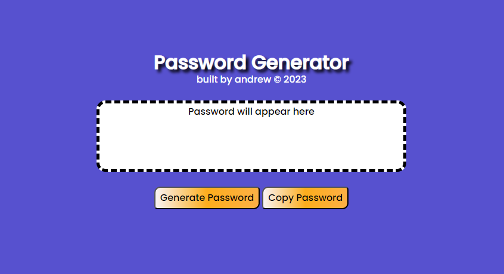
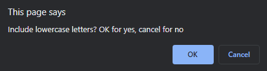
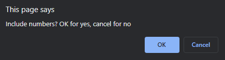
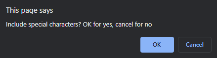
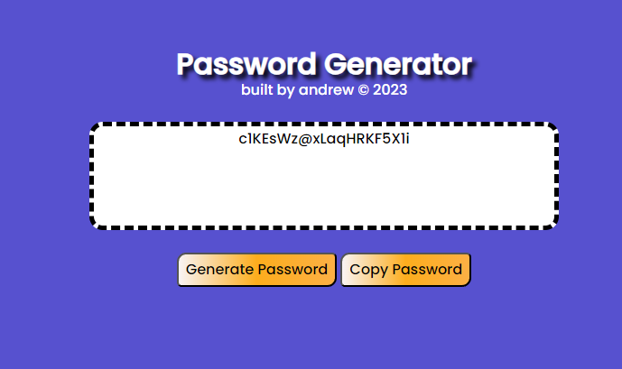

# Challenge 3

## Password Generator
This application is used to generate random passwords based on user selection of:

- Character length (8-128 characters)
- Uppercase letters
- Lowercase letters
- Numbers
- Special Characters

Users are guided through a series of window prompts where the above selections are made and then printed to the screen.

## Acceptance Criteria
```GIVEN I need a new, secure password
WHEN I click the button to generate a password
THEN I am presented with a series of prompts for password criteria
WHEN prompted for password criteria
THEN I select which criteria to include in the password
WHEN prompted for the length of the password
THEN I choose a length of at least 8 characters and no more than 128 characters
WHEN asked for character types to include in the password
THEN I confirm whether or not to include lowercase, uppercase, numeric, and/or special characters
WHEN I answer each prompt
THEN my input should be validated and at least one character type should be selected
WHEN all prompts are answered
THEN a password is generated that matches the selected criteria
WHEN the password is generated
THEN the password is either displayed in an alert or written to the page
```
## Application Screenshots








## Application Instructions
Users can access the password generator at this URL: https://andrewcmonson.github.io/challenge3/

Upon clicking "Generate Possword", users will be guided through prompts to complete generation.

## Reflection
- This project tested my knowledge of quite a few Javascript fundamentals including if statements, window alerts, prompts and confirmations, as well as interacting with the DOM.
- Although I was given boilerplate HTML and CSS, I chose to use my own to practice the UI building experience.
- I chose to provide two solutions to a few areas of this project to test my own knowledge and also make the code more readable, accessible and succinct. My final version includes code up to the point that we have currently learned in my course as of weeks 3 and 4.
- Tools used to build this application include CSS3, HTML5 and JS.
- Outside of the stated acceptance criteria, I chose to add a copy button to copy the password to the user's clipboard for use elsewhere.